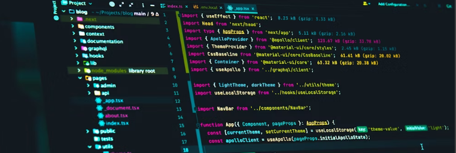

# Encriptador de Texto

## Desarrollado por Manuel Sandoval Fonseca

### Descripción
El **Encriptador de Texto** es una herramienta web que permite encriptar y desencriptar texto de manera sencilla. La página web cuenta con una interfaz intuitiva y animaciones interactivas para una mejor experiencia del usuario.

### Características
- **Caja de texto**: para ingresar el texto a encriptar o desencriptar.
- **Caja de resultado**: para mostrar el texto encriptado o desencriptado.
- **Botón "Encriptar"**: encripta el texto ingresado.
- **Botón "Desencriptar"**: desencripta el texto ingresado.
- **Botón "Copiar"**: copia el resultado al portapapeles.
- **Botón "Limpiar"**: borra el contenido de las cajas y devuelve los elementos a su estado inicial.
- **Animaciones en botones**: los botones reducen su tamaño y cambian de color al pasar el puntero por encima.
- **Responsividad**: la página es completamente responsiva y se adapta a dispositivos móviles y tabletas.

### Tecnologías

### Cómo utilizar
1. Escribe el texto que deseas encriptar o desencriptar en la caja de texto.
2. Haz clic en el botón "Encriptar" para encriptar el texto o en el botón "Desencriptar" para desencriptarlo.
3. El resultado aparecerá en la caja de resultado.
4. Puedes copiar el resultado al portapapeles haciendo clic en el botón "Copiar".
5. Para limpiar el contenido y restablecer la página, haz clic en el botón "Limpiar".

### Enlace del proyecto alojado en Vercel:
https://encriptador2024-chi.vercel.app/

